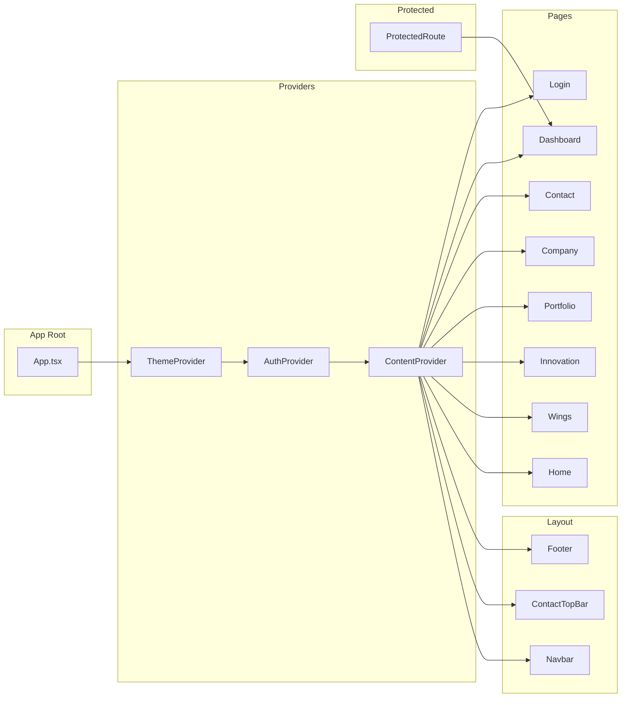
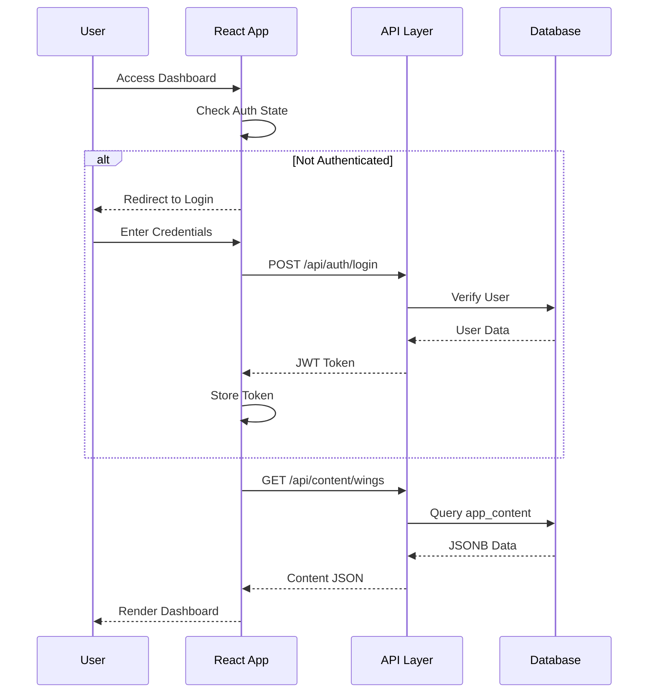
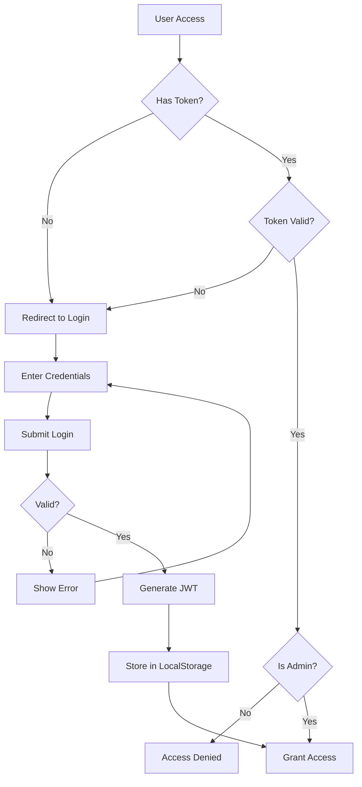
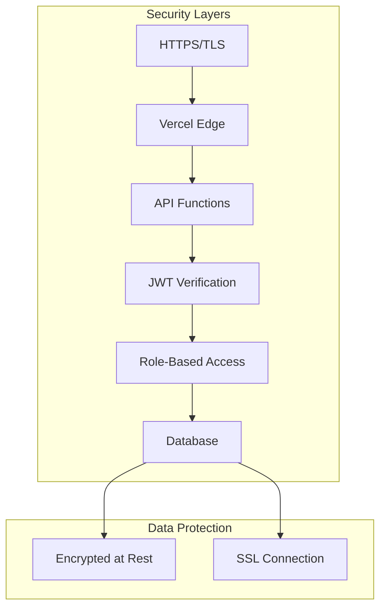
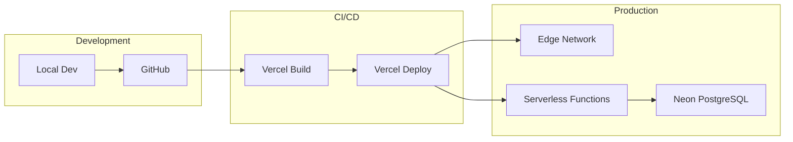

# System Architecture

## 1. Overview

Techtonic follows a modern **JAMstack architecture** with serverless backend functions. The system is designed for scalability, security, and maintainability.

---

## 2. Architecture Diagram

```mermaid
graph TB
    subgraph "Client Layer"
        B[Browser] --> R[React SPA]
        R --> RC[React Components]
        RC --> CTX[Context Providers]
    end
    
    subgraph "Service Layer"
        CTX --> AS[Auth Service]
        CTX --> CS[Content Service]
        AS --> API
        CS --> API
    end
    
    subgraph "API Layer - Vercel Functions"
        API[API Gateway]
        API --> AUTH[/api/auth/*]
        API --> CONTENT[/api/content/*]
        API --> CONFIG[/api/config/*]
    end
    
    subgraph "Data Layer"
        AUTH --> DB[(Neon PostgreSQL)]
        CONTENT --> DB
        CONFIG --> DB
    end
    
    subgraph "CDN Layer"
        CDN[Vercel Edge Network]
        CDN --> B
    end
```

---

## 3. Component Architecture



---

## 4. Data Flow



---

## 5. Authentication Flow



---

## 6. Technology Stack

### Frontend

| Layer | Technology | Purpose |
|-------|------------|---------|
| UI Framework | React 18 | Component-based UI |
| Language | TypeScript | Type safety |
| Build Tool | Vite | Fast development |
| Styling | Tailwind CSS | Utility-first CSS |
| Animations | Framer Motion | Smooth transitions |
| Routing | React Router v6 | Client-side routing |
| State | Context API | Global state management |

### Backend

| Layer | Technology | Purpose |
|-------|------------|---------|
| Runtime | Node.js | JavaScript runtime |
| API | Vercel Functions | Serverless functions |
| Database | Neon PostgreSQL | Serverless Postgres |
| Auth | JWT + bcrypt | Secure authentication |

### Infrastructure

| Layer | Technology | Purpose |
|-------|------------|---------|
| Hosting | Vercel | Edge deployment |
| CDN | Vercel Edge | Global content delivery |
| Database | Neon | Serverless PostgreSQL |
| Version Control | Git/GitHub | Source control |

---

## 7. Security Architecture



### Security Measures

| Measure | Implementation |
|---------|----------------|
| Transport | HTTPS enforced |
| Authentication | JWT with 24h expiry |
| Password Storage | bcrypt hashing |
| API Protection | Token verification middleware |
| Database | SSL connection required |
| Secrets | Environment variables |

---

## 8. Scalability

The architecture supports horizontal scaling:

- **Stateless API**: Vercel Functions scale automatically
- **Serverless DB**: Neon auto-scales compute
- **CDN**: Edge caching for static assets
- **No Server State**: JWT-based auth (no sessions)

---

## 9. Deployment Architecture


