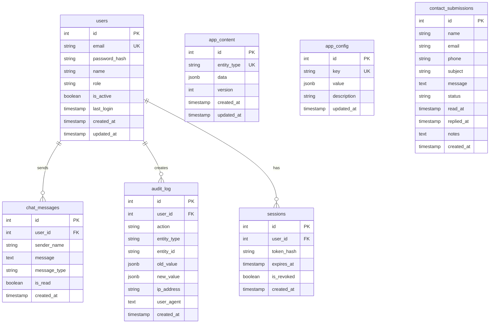

# Database Documentation

## Overview

Techtonic uses **Neon PostgreSQL** as its primary database. The schema follows a JSONB-first approach for flexibility in content management.

---

## Connection

| Property | Value |
|----------|-------|
| Host | Neon Cloud |
| Database | neondb |
| SSL | Required |
| Driver | pg (node-postgres) |

---

## Entity Relationship Diagram



---

## Tables

### 1. users

Admin user accounts for authentication.

| Column | Type | Constraints | Description |
|--------|------|-------------|-------------|
| id | SERIAL | PRIMARY KEY | Unique identifier |
| email | VARCHAR(255) | UNIQUE, NOT NULL | Login email |
| password_hash | VARCHAR(255) | NOT NULL | bcrypt hashed password |
| name | VARCHAR(255) | | Display name |
| role | VARCHAR(50) | DEFAULT 'admin' | User role |
| is_active | BOOLEAN | DEFAULT true | Account status |
| last_login | TIMESTAMP | | Last login time |
| created_at | TIMESTAMP | DEFAULT NOW() | Creation time |
| updated_at | TIMESTAMP | DEFAULT NOW() | Last update |

**Indexes:**
- `idx_users_email` - Email lookups
- `idx_users_role` - Role filtering

---

### 2. app_content

Dynamic content storage using JSONB.

| Column | Type | Constraints | Description |
|--------|------|-------------|-------------|
| id | SERIAL | PRIMARY KEY | Unique identifier |
| entity_type | VARCHAR(50) | UNIQUE, NOT NULL | Content type |
| data | JSONB | NOT NULL | Content data |
| version | INTEGER | DEFAULT 1 | Version number |
| created_at | TIMESTAMP | DEFAULT NOW() | Creation time |
| updated_at | TIMESTAMP | DEFAULT NOW() | Last update |

**Entity Types:**

| Type | Description |
|------|-------------|
| wings | Company divisions |
| team | Team members |
| timeline | Company milestones |
| partnerships | Partner organizations |
| projects | Portfolio projects |
| techStack | Technology stack |
| roadmap | Future roadmap |
| homeContent | Home page content |
| companyContent | Company page content |
| innovationContent | Innovation page content |

---

### 3. app_config

Site-wide configuration settings.

| Column | Type | Constraints | Description |
|--------|------|-------------|-------------|
| id | SERIAL | PRIMARY KEY | Unique identifier |
| key | VARCHAR(100) | UNIQUE, NOT NULL | Config key |
| value | JSONB | NOT NULL | Config value |
| description | TEXT | | Key description |
| updated_at | TIMESTAMP | DEFAULT NOW() | Last update |

**Config Keys:**

| Key | Description |
|-----|-------------|
| siteSettings | Site name, tagline, maintenance mode |
| contactConfig | Contact info, social links |

---

### 4. contact_submissions

Form submissions from contact page.

| Column | Type | Constraints | Description |
|--------|------|-------------|-------------|
| id | SERIAL | PRIMARY KEY | Unique identifier |
| name | VARCHAR(255) | NOT NULL | Sender name |
| email | VARCHAR(255) | NOT NULL | Sender email |
| phone | VARCHAR(50) | | Sender phone |
| subject | VARCHAR(255) | | Message subject |
| message | TEXT | NOT NULL | Message body |
| status | VARCHAR(50) | DEFAULT 'unread' | Read status |
| read_at | TIMESTAMP | | When read |
| replied_at | TIMESTAMP | | When replied |
| notes | TEXT | | Admin notes |
| created_at | TIMESTAMP | DEFAULT NOW() | Submission time |

---

### 5. chat_messages

Admin chat functionality.

| Column | Type | Constraints | Description |
|--------|------|-------------|-------------|
| id | SERIAL | PRIMARY KEY | Unique identifier |
| user_id | INTEGER | FK → users | Sender user |
| sender_name | VARCHAR(100) | NOT NULL | Display name |
| message | TEXT | NOT NULL | Message content |
| message_type | VARCHAR(50) | DEFAULT 'text' | Message type |
| is_read | BOOLEAN | DEFAULT false | Read status |
| created_at | TIMESTAMP | DEFAULT NOW() | Send time |

---

### 6. audit_log

Change tracking for compliance.

| Column | Type | Constraints | Description |
|--------|------|-------------|-------------|
| id | SERIAL | PRIMARY KEY | Unique identifier |
| user_id | INTEGER | FK → users | Acting user |
| action | VARCHAR(100) | NOT NULL | Action type |
| entity_type | VARCHAR(50) | | Modified entity |
| entity_id | VARCHAR(100) | | Entity identifier |
| old_value | JSONB | | Previous value |
| new_value | JSONB | | New value |
| ip_address | VARCHAR(50) | | Client IP |
| user_agent | TEXT | | Client browser |
| created_at | TIMESTAMP | DEFAULT NOW() | Action time |

---

### 7. sessions

JWT session management.

| Column | Type | Constraints | Description |
|--------|------|-------------|-------------|
| id | SERIAL | PRIMARY KEY | Unique identifier |
| user_id | INTEGER | FK → users (CASCADE) | Session owner |
| token_hash | VARCHAR(255) | NOT NULL | Hashed token |
| expires_at | TIMESTAMP | NOT NULL | Expiration time |
| is_revoked | BOOLEAN | DEFAULT false | Revocation status |
| created_at | TIMESTAMP | DEFAULT NOW() | Creation time |

---

## Triggers

### updated_at Auto-Update

All tables with `updated_at` column have a trigger:

```sql
CREATE TRIGGER update_<table>_updated_at
    BEFORE UPDATE ON <table>
    FOR EACH ROW
    EXECUTE FUNCTION update_updated_at_column();
```

---

## Statistics

| Table | Records |
|-------|---------|
| users | 1 |
| app_content | 10 |
| app_config | 2 |
| contact_submissions | 0 |
| chat_messages | 0 |
| audit_log | 0 |
| sessions | 0 |

---

## Backup & Recovery

### Export Schema
```bash
pg_dump -s $DATABASE_URL > schema_backup.sql
```

### Export Data
```bash
pg_dump -a $DATABASE_URL > data_backup.sql
```

### Restore
```bash
psql $DATABASE_URL < backup.sql
```

---

## Management Scripts

| Script | Purpose |
|--------|---------|
| `database/deploy.js` | Full deployment |
| `database/schema-final.sql` | Schema definition |
| `database/seed-final.sql` | Seed data |
| `database/create-admin.js` | Create admin user |
