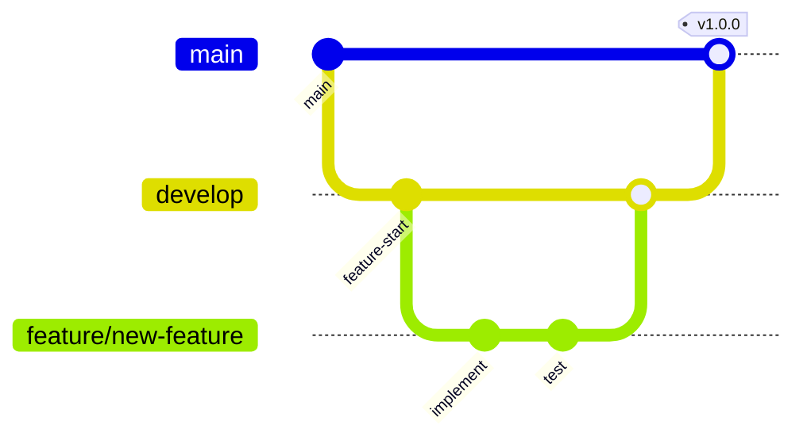

# Developer Guide

## Overview

This guide helps developers set up their local environment and understand the codebase structure.

---

## Prerequisites

| Requirement | Version |
|-------------|---------|
| Node.js | 18.x+ |
| npm | 9.x+ |
| Git | 2.x+ |
| Editor | VS Code (recommended) |

---

## Setup

### 1. Clone Repository

```bash
git clone https://github.com/your-org/techtonic.git
cd techtonic
```

### 2. Install Dependencies

```bash
npm install
```

### 3. Configure Environment

```bash
cp .env.example .env
```

Edit `.env`:
```env
DATABASE_URL=your_neon_connection_string
JWT_SECRET=development_secret_key
```

### 4. Start Development Server

```bash
npm run dev
```

Visit: `http://localhost:5173`

---

## Project Structure

```
techtonic/
├── api/                      # Vercel Serverless Functions
│   ├── auth/                # Authentication APIs
│   │   ├── login.js        # JWT login
│   │   ├── verify.js       # Token verification
│   │   ├── users.js        # User management
│   │   └── middleware.js   # Auth middleware
│   ├── content/            # Content APIs
│   │   ├── [type].js       # Dynamic content CRUD
│   │   └── index.js        # Bulk operations
│   └── config/             # Config APIs
│       └── [key].js        # Site configuration
│
├── components/              # React Components
│   ├── AuthContext.tsx     # Authentication state
│   ├── ContentContext.tsx  # Content state
│   ├── ProtectedRoute.tsx  # Route protection
│   ├── ThemeContext.tsx    # Theme state
│   ├── dashboard/          # Dashboard components
│   ├── layout/             # Layout components
│   └── ui/                 # Reusable UI components
│
├── data/                    # Static default data
│   ├── pages/              # Page content defaults
│   ├── partnerships.ts
│   ├── projects.ts
│   ├── team.ts
│   ├── timeline.ts
│   └── wings.ts
│
├── database/                # Database files
│   ├── schema-final.sql   # Production schema
│   ├── seed-final.sql     # Seed data
│   ├── deploy.js          # Deployment script
│   └── create-admin.js    # Admin creation
│
├── docs/                    # Documentation
│   ├── ARCHITECTURE.md
│   ├── API.md
│   ├── DATABASE.md
│   ├── DEPLOYMENT.md
│   └── DEVELOPER.md
│
├── pages/                   # Page components
│   ├── Home.tsx
│   ├── Wings.tsx
│   ├── Innovation.tsx
│   ├── Portfolio.tsx
│   ├── Company.tsx
│   ├── Contact.tsx
│   ├── Dashboard.tsx
│   └── Login.tsx
│
├── services/                # API services
│   ├── api.ts              # API client
│   ├── auth.ts             # Auth service
│   ├── contentStorage.ts   # Content storage
│   └── configStorage.ts    # Config storage
│
├── App.tsx                  # Application root
├── main.tsx                # Entry point
├── types.ts                # TypeScript types
└── index.css               # Global styles
```

---

## Development Workflow

### Branch Strategy



### Naming Conventions

| Type | Convention | Example |
|------|------------|---------|
| Components | PascalCase | `UserProfile.tsx` |
| Hooks | camelCase with 'use' | `useAuth.ts` |
| Services | camelCase | `authService.ts` |
| Utils | camelCase | `formatDate.ts` |
| Constants | SCREAMING_SNAKE | `API_BASE_URL` |

---

## Key Concepts

### 1. Context Providers

The app uses React Context for global state:

```tsx
<ThemeProvider>
  <AuthProvider>
    <ContentProvider>
      <App />
    </ContentProvider>
  </AuthProvider>
</ThemeProvider>
```

### 2. Protected Routes

Dashboard requires authentication:

```tsx
<Route path="/dashboard" element={
  <ProtectedRoute requireAdmin>
    <Dashboard />
  </ProtectedRoute>
} />
```

### 3. Hybrid Storage

Content storage uses API in production, localStorage in dev:

```typescript
const USE_API = !window.location.hostname.includes('localhost');
```

---

## Common Tasks

### Add New Page

1. Create component in `pages/`
2. Add route in `App.tsx`
3. Add navigation link

### Add New API Endpoint

1. Create file in `api/`
2. Export default handler function
3. Use auth middleware if needed

### Add New Content Type

1. Add to `types.ts`
2. Add to `contentStorage.ts`
3. Add to `ContentContext.tsx`
4. Add to API `VALID_TYPES`

---

## Testing

### Local API Testing

```bash
# Start dev server
npm run dev

# Test endpoint
curl http://localhost:5173/api/content/wings
```

### Build Testing

```bash
# Build for production
npm run build

# Preview build
npm run preview
```

---

## Coding Standards

### TypeScript

- Enable strict mode
- Define interfaces for all props
- Avoid `any` type

### React

- Use functional components
- Use hooks for state/effects
- Memoize expensive computations

### CSS

- Use Tailwind utility classes
- Follow mobile-first approach
- Use CSS variables for theming

---

## VS Code Extensions

Recommended extensions:

```json
{
  "recommendations": [
    "bradlc.vscode-tailwindcss",
    "esbenp.prettier-vscode",
    "dbaeumer.vscode-eslint",
    "ms-vscode.vscode-typescript-next"
  ]
}
```

---

## Troubleshooting

### Module not found

```bash
rm -rf node_modules
npm install
```

### TypeScript errors

```bash
npm run build
# Check output for errors
```

### Database connection failed

```bash
# Verify connection string
node -e "console.log(process.env.DATABASE_URL)"
```

---

## Resources

- [React Documentation](https://react.dev)
- [TypeScript Handbook](https://www.typescriptlang.org/docs)
- [Tailwind CSS](https://tailwindcss.com/docs)
- [Framer Motion](https://www.framer.com/motion)
- [Vercel Functions](https://vercel.com/docs/functions)
- [Neon PostgreSQL](https://neon.tech/docs)
