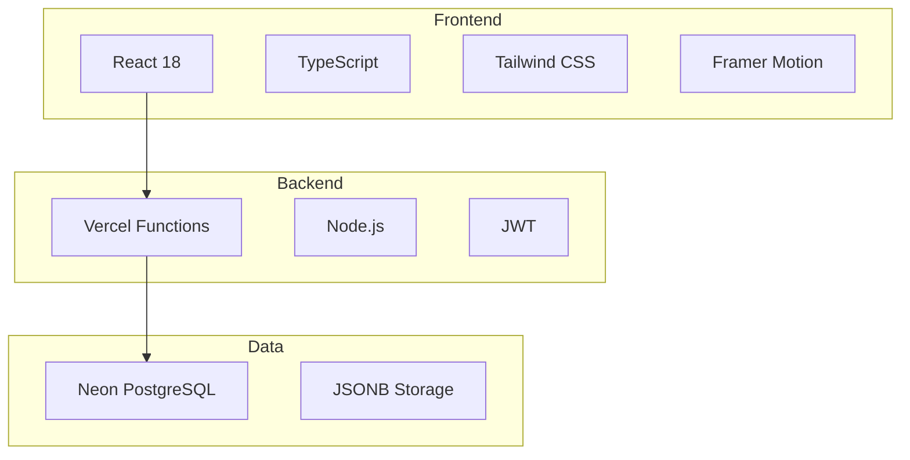
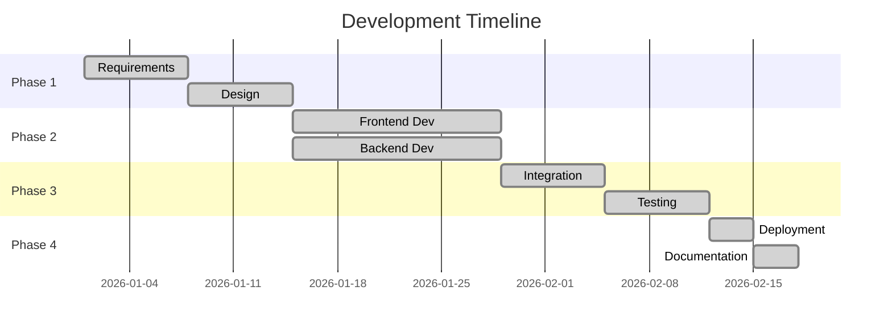
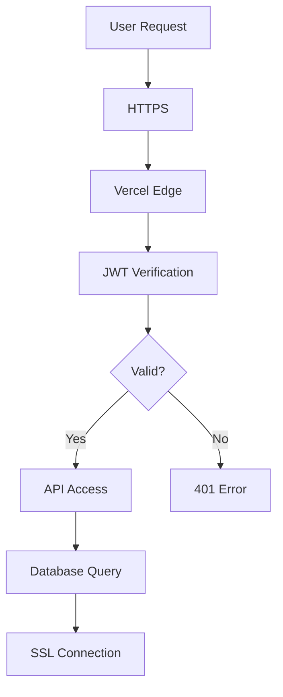

# Software Development Plan (SDP)

## Document Information

| Field | Value |
|-------|-------|
| Project | Techtonic |
| Version | 2.0 |
| Date | 2026-01-23 |
| Status | Production Ready |

---

## 1. Executive Summary

Techtonic is a modern enterprise web platform showcasing software development, robotics & automation, and consultancy services. The system features a dynamic content management system, secure authentication, and seamless cloud deployment.

### Key Objectives

- ✅ Modern, responsive UI with premium aesthetics
- ✅ Dynamic CMS with admin panel
- ✅ Secure JWT authentication
- ✅ Serverless architecture for scalability
- ✅ PostgreSQL database for persistence

---

## 2. Project Scope

### 2.1 In Scope

| Feature | Description |
|---------|-------------|
| Public Website | Home, Wings, Innovation, Portfolio, Company, Contact |
| Admin Dashboard | Content management, settings, user management |
| Authentication | JWT-based login with role-based access |
| Database | PostgreSQL with JSONB content storage |
| API Layer | RESTful API via Vercel Functions |
| Deployment | Vercel with Neon PostgreSQL |

### 2.2 Out of Scope

- E-commerce functionality
- User registration (admin-only access)
- Real-time notifications
- Mobile applications

---

## 3. System Requirements

### 3.1 Functional Requirements

| ID | Requirement | Priority |
|----|------------|----------|
| FR-01 | Display dynamic content on all pages | High |
| FR-02 | Admin login with JWT authentication | High |
| FR-03 | CRUD operations for all content types | High |
| FR-04 | Site settings management | Medium |
| FR-05 | Contact form submissions | Medium |
| FR-06 | Dark/light theme toggle | Low |
| FR-07 | Responsive design | High |

### 3.2 Non-Functional Requirements

| ID | Requirement | Target |
|----|------------|--------|
| NFR-01 | Page load time | < 3 seconds |
| NFR-02 | Uptime | 99.9% |
| NFR-03 | Security | HTTPS, JWT, bcrypt |
| NFR-04 | Browser Support | Chrome, Firefox, Safari, Edge |
| NFR-05 | Mobile Support | iOS 14+, Android 10+ |

---

## 4. Technical Architecture

### 4.1 Technology Stack

### 4.2 Component Overview

| Layer | Components |
|-------|------------|
| Presentation | React, Tailwind, Framer Motion |
| Application | Context Providers, Services |
| API | Vercel Functions |
| Data | PostgreSQL, JSONB |

---

## 5. Development Process

### 5.1 Methodology

Agile/Scrum with 2-week sprints

### 5.2 Development Phases

### 5.3 Milestones

| Milestone | Date | Status |
|-----------|------|--------|
| Requirements Complete | 2026-01-07 | ✅ Done |
| Design Complete | 2026-01-14 | ✅ Done |
| Development Complete | 2026-01-21 | ✅ Done |
| Testing Complete | 2026-01-22 | ✅ Done |
| Production Deployment | 2026-01-23 | ✅ Done |

---

## 6. Risk Assessment

| Risk | Probability | Impact | Mitigation |
|------|-------------|--------|------------|
| Database downtime | Low | High | Neon auto-recovery, backups |
| Security breach | Low | Critical | JWT, bcrypt, HTTPS |
| Performance issues | Medium | Medium | CDN, lazy loading, caching |
| API failures | Low | High | Error handling, fallbacks |

---

## 7. Quality Assurance

### 7.1 Testing Strategy

| Test Type | Coverage |
|-----------|----------|
| Unit Testing | Components, utilities |
| Integration Testing | API endpoints |
| E2E Testing | User flows |
| Performance Testing | Lighthouse audits |

### 7.2 Quality Metrics

| Metric | Target |
|--------|--------|
| Lighthouse Performance | > 90 |
| Lighthouse Accessibility | > 90 |
| Code Coverage | > 80% |
| Bug Density | < 1/KLOC |

---

## 8. Security Plan

### 8.1 Security Measures

### 8.2 Compliance

| Standard | Status |
|----------|--------|
| HTTPS | ✅ Enabled |
| Password Hashing | ✅ bcrypt |
| Token Security | ✅ JWT with expiry |
| Data Encryption | ✅ SSL/TLS |

---

## 9. Deployment Plan

### 9.1 Environments

| Environment | URL | Purpose |
|-------------|-----|---------|
| Development | localhost:5173 | Local development |
| Production | techtonic.vercel.app | Live site |

### 9.2 Deployment Checklist

- [x] Code committed to GitHub
- [x] Environment variables configured
- [x] Database schema deployed
- [x] Seed data loaded
- [x] SSL certificate active
- [x] DNS configured
- [x] Monitoring enabled

---

## 10. Maintenance Plan

### 10.1 Routine Tasks

| Task | Frequency |
|------|-----------|
| Security updates | Monthly |
| Dependency updates | Monthly |
| Database backups | Daily (Neon) |
| Performance review | Quarterly |

### 10.2 Support

| Level | Response Time |
|-------|---------------|
| Critical | 1 hour |
| High | 4 hours |
| Medium | 24 hours |
| Low | 72 hours |

---

## 11. Appendices

### A. Glossary

| Term | Definition |
|------|------------|
| JWT | JSON Web Token for authentication |
| JSONB | Binary JSON storage in PostgreSQL |
| CDN | Content Delivery Network |
| SPA | Single Page Application |

### B. References

- [React Documentation](https://react.dev)
- [Vercel Documentation](https://vercel.com/docs)
- [Neon Documentation](https://neon.tech/docs)
- [Tailwind CSS](https://tailwindcss.com)

---

## Document History

| Version | Date | Author | Changes |
|---------|------|--------|---------|
| 1.0 | 2026-01-15 | Team | Initial draft |
| 2.0 | 2026-01-23 | Team | Production release |
