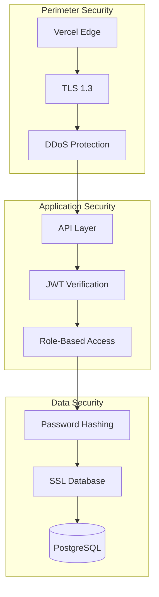

# Security Documentation

## Overview

This document outlines the security measures implemented in Techtonic.

---

## Security Architecture



---

## Authentication

### JWT Implementation

| Property | Value |
|----------|-------|
| Algorithm | HS256 |
| Token Expiry | 24 hours |
| Storage | localStorage |
| Refresh | Re-login required |

### Token Structure

```json
{
  "header": {
    "alg": "HS256",
    "typ": "JWT"
  },
  "payload": {
    "userId": 1,
    "email": "admin@tectonic.com",
    "role": "admin",
    "iat": 1706040000,
    "exp": 1706126400
  }
}
```

---

## Password Security

### Hashing

| Property | Value |
|----------|-------|
| Algorithm | bcrypt |
| Salt Rounds | 10 |
| Storage | Hashed only |

### Password Requirements

- Minimum 8 characters
- Stored as bcrypt hash
- Never logged or displayed

---

## API Security

### Protected Endpoints

| Endpoint | Auth Required | Role Required |
|----------|---------------|---------------|
| GET /api/content/* | No | - |
| POST /api/content/* | Yes | admin |
| GET /api/auth/users | Yes | admin |
| POST /api/auth/users | Yes | admin |

### CORS Configuration

```javascript
res.setHeader('Access-Control-Allow-Origin', '*');
res.setHeader('Access-Control-Allow-Methods', 'GET, POST, PUT, DELETE');
res.setHeader('Access-Control-Allow-Headers', 'Content-Type, Authorization');
```

---

## Data Protection

### Transport Security

- HTTPS enforced (Vercel)
- TLS 1.3
- HSTS headers

### Database Security

- SSL connection required
- Credentials in environment variables
- Connection pooling

---

## Threat Model

| Threat | Mitigation |
|--------|------------|
| SQL Injection | Parameterized queries |
| XSS | React auto-escaping |
| CSRF | SameSite cookies |
| Brute Force | Rate limiting (future) |
| Token Theft | Short expiry, HTTPS only |

---

## Incident Response

### Severity Levels

| Level | Response Time | Example |
|-------|---------------|---------|
| Critical | 1 hour | Data breach |
| High | 4 hours | Auth bypass |
| Medium | 24 hours | Minor vulnerability |
| Low | 72 hours | Best practice violation |

### Response Steps

1. Identify and contain
2. Assess impact
3. Eradicate threat
4. Recover systems
5. Document lessons learned

---

## Compliance

### Current Status

| Standard | Status |
|----------|--------|
| HTTPS | ✅ Enabled |
| Password Security | ✅ bcrypt |
| Session Management | ✅ JWT |
| Data Encryption | ✅ SSL |

---

## Security Checklist

- [x] HTTPS enabled
- [x] Passwords hashed with bcrypt
- [x] JWT authentication
- [x] Environment variables for secrets
- [x] SQL injection prevention
- [x] Input validation
- [ ] Rate limiting (future)
- [ ] 2FA (future)
- [ ] Audit logging (future)

---

## Recommendations

### Immediate

1. Change default admin password
2. Use strong JWT_SECRET
3. Enable Vercel Analytics

### Future

1. Implement rate limiting
2. Add 2FA for admins
3. Enable audit logging
4. Regular security audits
